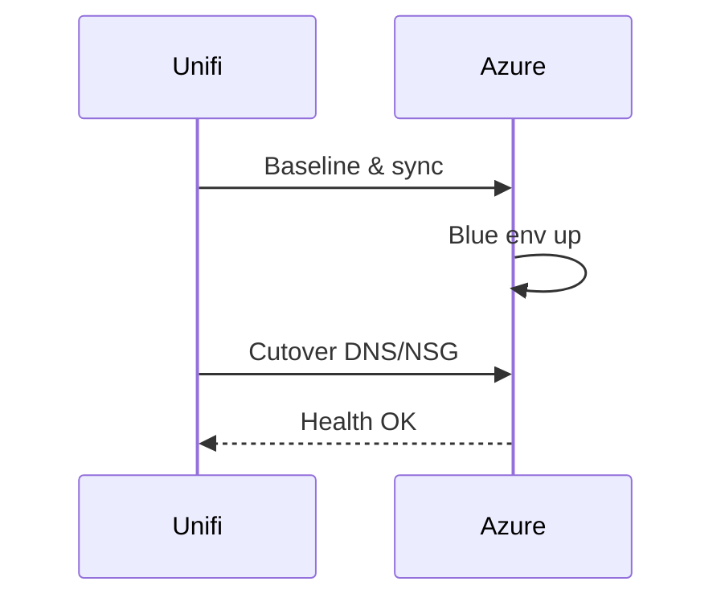

# Unifi → Azure Migration Runbook
Steps for a safe service migration to Azure with backout.

## Stages
1. Discovery & inventory
2. Landing zone (vnet, subnets, NSGs)
3. Data sync (blue/green)
4. DNS + NSG cutover
5. Verification & backout

## Outcome
- Clean cutover with defined backout (A/B DNS swap)
